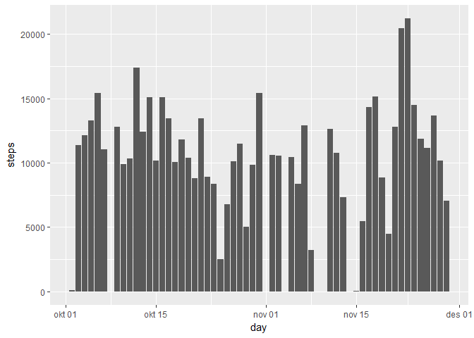

## Loading and preprocessing the data

```r
df <- read.csv("activity.csv")
df$date <- as.Date(as.character(df$date), "%Y-%m-%d")
```

## What is mean total number of steps taken per day?

```r
hist_mean_med <- function(df)
{
  h <- setNames(aggregate(df$steps, list(df$date), sum), c("day", "steps"))
  hist(h$steps, 10, main="Step frequency", xlab="Total number of steps a day")
  print("mean")
  print(mean(h$steps))
  print("median")
  print(median(h$steps))
}

hist_mean_med(df)
```

<!-- -->

```
## [1] "mean"
## [1] NA
## [1] "median"
## [1] NA
```


## What is the average daily activity pattern?

```r
lineplot <- function(df)
{
  i <- aggregate(df$steps, list(df$interval), mean, na.rm=TRUE)
  plot(i$Group.1, i$x, type="l", xlab= "steps", ylab="freqency")
  return(i)
}

i <- lineplot(df)
max_step_int <- i[which.max(i$x), "Group.1"]
axis(side=1, at=max_step_int)
abline(v=max_step_int, col="red")
```

<!-- -->


## Imputing missing values

```r
df_fix <- df
df_fix[is.na(df_fix$steps)  , "steps"] <- mean(df_fix$steps, na.rm=TRUE)
```


## Are there differences in activity patterns between weekdays and weekends?

```r
library(lubridate)
```

```
## 
## Attaching package: 'lubridate'
```

```
## The following object is masked from 'package:base':
## 
##     date
```

```r
isWeekends <- wday(df_fix$date) == 6 | wday(df_fix$date) == 7

#make extra column, since assigment ask for it, but its not really used.
df_fix[isWeekends, "dayType"] <- as.factor("weekend")
#need this to add another level to the factor
levels(df_fix$dayType) <- c(levels(df_fix$dayType), "weekday")  
df_fix[!isWeekends, "dayType"] <- as.factor("weekday")


par(mfrow=c(2,1))
f <- lineplot( df_fix[isWeekends,] )
g <- lineplot( df_fix[!isWeekends, ] )
axis(side=1)
```

<!-- -->
